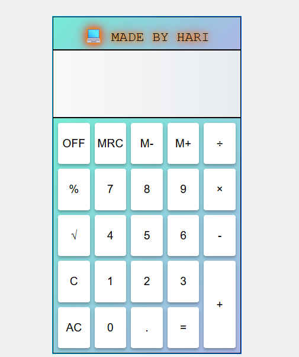

# 🧮 Simple Calculator – Made by OG Hari

A clean and fully functional calculator built using **HTML**, **CSS**, and **JavaScript**.  
This calculator is responsive, user-friendly, and designed with stylish gradients and shadows.

---

---

## ✨ Features

- Basic Arithmetic: ➕ ➖ ✖️ ➗  
- Special Buttons:  
  - `M+`, `M-`, `MRC`: Memory functions  
  - `√`: Square root  
  - `%`: Percentage  
  - `C`, `AC`, `OFF`: Controls  
- Responsive design (works on mobile & desktop)
- Gradient borders and neon header text
- Clean UI with grid layout
- Button press hover effect

---

## 🛠️ Technologies Used

- **HTML5** (structure)
- **CSS3** (design, grid, responsiveness)
- **Vanilla JavaScript** (logic and DOM manipulation)

---

   
